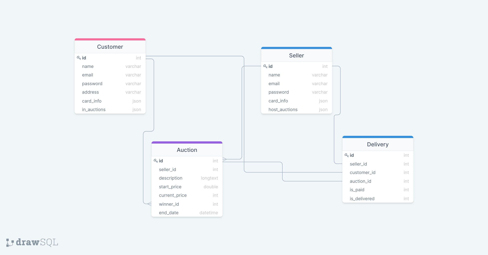

# Задание 1. Аукцион

## Функциональные требования

Хотим иметь 2 типа пользователей: продавец и покупатель. Для обоих типов нужен личный кабинет

Общий функционал личного кабинета:

+ Возможность залогиниться и запомнить пароль
+ Возможность востановления доступа к аккаунту
+ Просмотр списка аукционов, в которых участвует пользователь (зависит от роли пользователя)

Доп функционал покупателя:

+ Возможность сохранить данные об оплате
+ Возможность сохранить данные об адресе доставки
+ Оповещение пользователя об изменении ставки в аукционе, где он побеждал.
+ Оповещение о конце аукциона и статусе покупателя.

Так же для организации процесса аукциона понадобится несколько сущностей: аукцион и статус доставки.

Аукцион должен обеспечивать возможность поднятия ставки и завершения торгов.

Сущность доставки должна хранить информацию о статусе доставки, цене товара и обеих сторонах сделки.

## Роли

### Продавец

+ Создание аукциона:
    + Добавление описания
    + Выставление стартовой цены
    + Выставление срока
+ Просмотр статуса оплаты товара
+ Получение информации о победителе

### Покупатель

+ Ставка на аукционе
+ Повышение ставки
+ Получение оповещений об изменении цен и закрытии аукционов
+ Указание адреса доставки
+ Просмотр статуса доставки товара
+ Получение информации об оплате

## Объекты

+ Seller
+ Customer
+ Auction
+ Delivery

## Связи

+ Seller - Auction one-to-many
+ Customer - Auction one-to-many
+ Customer - Delivery one-to-one
+ Seller - Delivery one-to-one
+ Auction - Delivery one-to-one

## Схема 

https://drawsql.app/db-hw/diagrams/auction